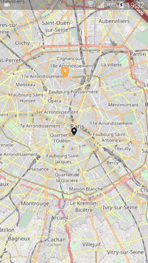

# Map markers

A collection of markers for Flutter Map

- **Bubble marker**: a clickable marker that pops up a bubble with a custom widget inside
- **Photo marker**: a marker that pops up a photo with a hero animation



```dart
import 'package:flutter/material.dart';
import 'package:flutter_map/flutter_map.dart';
import 'package:latlong/latlong.dart';
import 'package:map_markers/map_markers.dart';
import 'photo_page.dart';


class MapPage extends StatelessWidget {
  @override
  Widget build(BuildContext context) {
    return Scaffold(
      body: FlutterMap(
        mapController: MapController(),
        options: MapOptions(center: LatLng(48.853831, 2.348722), zoom: 12.0),
        layers: [
          TileLayerOptions(
              urlTemplate: "https://{s}.tile.openstreetmap.org/{z}/{x}/{y}.png",
              subdomains: ['a', 'b', 'c']),
          MarkerLayerOptions(markers: <Marker>[
            Marker(
                height: 100.0,
                width: 120.0,
                point: LatLng(48.853831, 2.348722),
                builder: (context) => BubbleMarker(
                      bubbleColor: Colors.white,
                      bubbleContentWidgetBuilder: (BuildContext context) {
                        return const Text("My marker");
                      },
                    )),
            Marker(
                width: 35.0,
                height: 35.0,
                point: LatLng(48.886463, 2.341169),
                builder: (BuildContext context) {
                  return PhotoMarker(
                    imageAsset: "assets/photo.jpeg",
                    name: "Montmartre",
                    widgetBuilder: (BuildContext context) {
                      return Icon(Icons.location_on,
                          size: 35.0, color: Colors.orangeAccent);
                    },
                    routeBuilder: (BuildContext context) =>
                        Navigator.of(context).push(
                            MaterialPageRoute(builder: (BuildContext context) {
                      return PhotoPage(tag: "Montmartre");
                    })),
                  );
                })
          ]),
        ],
      ),
    );
  }
}

```
